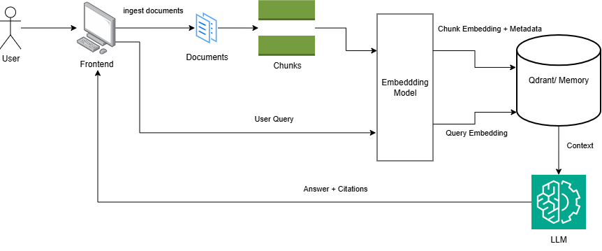

> **Author:** Eddy  
> **Email:** limeddy1125@gmail.com

## Table of Contents

- [1. Project Overview](#1-project-overview)
- [2. Setup Instructions](#2-setup-instructions)
- [3. Architecture](#3-architecture)
- [4. Evaluation & Testing](#4-evaluation--testing)
- [5. Extensions Implemented & Trade Offs](#5-extensions-implemented--trade-offs)
- [6. What I'd Ship Next](#6-what-id-ship-next)

## 1. Project Overview

**AI Policy & Product Helper** is a local-first RAG system for policy and product Q&A.  
It ingests internal policy docs, retrieves evidence with hybrid search, and generates grounded answers with citations and retrieval diagnostics.

### Key Features

- **Local-First + Flexible LLMs**: Runs fully offline with stub mode, or uses OpenRouter for real LLM responses.
- **Hybrid Retrieval**: Dense semantic retrieval + BM25-style lexical retrieval for stronger precision on policy wording.
- **Reciprocal Rank Fusion (RRF)**: Combines dense and lexical rankings into a more stable final top-k context set.
- **Confidence-Aware Behavior**: Detects weak/conflicting retrieval signals and abstains with a clarifying question instead of overconfident answers.
- **Grounded Evidence Output**: Returns citations and chunk-level metadata (including fused score and ranks) for transparency.
- **Evaluation Harness**: Includes a lightweight eval script to track citation hit rate, top-1 hit rate, and latency.

### Tech Stack

FastAPI, Next.js, Qdrant, Python, and React

## 2. Setup Instructions

### Prerequisites

- Docker & Docker Compose installed
- `.env` file (copy from `.env.example`)

### Quick Start

```bash
docker compose up --build
```

### Acess Points
- Frontend: http://localhost:3000  
- Backend:  http://localhost:8000/docs  
- Qdrant:   http://localhost:6333 (UI)

### LLM Provider Switch
- Default is **stub** (deterministic, offline).
- To use OpenRouter: set `LLM_PROVIDER=openrouter` and `OPENROUTER_API_KEY` in `.env`.
- To use Ollama: set `LLM_PROVIDER=stub` (keep stub) or extend `rag.py` to add an `OllamaLLM` class.

### Ingest Documents 
#### Option 1: Via Admin Panel (UI)
1. Open http://localhost:3000
2. Click Admin tab
3. Click Ingest Docs button

#### Option 2: Via curl
```bash
curl -X POST http://localhost:8000/api/ingest
```

### Ask Questions
#### Option 1: Via Admin Panel (UI)
1. Open http://localhost:3000
2. Enter query in the chat textbox
3. Click Send button

#### Option 2: Via curl
```bash
curl -X POST http://localhost:8000/api/ask \
  -H 'Content-Type: application/json' \
  -d '{"query": "Can a customer return a damaged blender after 20 days?"}'
```

## 3. Architecture

### Backend
The backend handles the full RAG pipeline:

- Embedding: converts document chunks and user queries into vectors.
- Retrieval: uses hybrid search (dense semantic + lexical keyword) to pull the best context.
- Generation: sends retrieved context to the LLM and returns an answer with citations.

### Frontend

The frontend has two main surfaces:

- Chat interface for asking policy/product questions and viewing cited answers.
- Admin ingestion panel to trigger document indexing into the vector store.

### Vector Store (Qdrant/Memory)
Qdrant/Memory stores chunk embeddings and metadata (for example title, section, source), enabling fast similarity search and citation-friendly retrieval.

### Data Flow
Below is the arhitecture diagram with data flow:


#### Ingest Flow

1. **User triggers ingest** via Admin Panel or `/api/ingest` endpoint
2. **Load Documents**: Backend loads all markdown files from the `data/` folder
3. **Chunking**: Documents are split into fixed-size chunks with overlap
4. **Embedding**: Each chunk is embedded using the embedding model (local or API-based)
5. **Store in Qdrant/Memory**: Embeddings + metadata (title, section, source) are persisted in the vector store
6. **Success Response**: Frontend displays indexed doc count and chunk count

#### Ask Flow

1. **User asks question** via Chat UI or `/api/ask` endpoint
2. **Query Embedding**: User query is embedded using the same embedding model
3. **Hybrid Retrieval**: 
   - Dense search: Find semantically similar chunks in Qdrant/Memory
   - Lexical search: Find keyword matches
   - Combine results and rank by relevance
4. **Context Assembly**: Top-k chunks are retrieved with their metadata
5. **LLM Generation**: Retrieved context is sent to the LLM (stub or real model)
6. **Answer + Citations**: LLM generates answer; backend extracts source title/section from retrieved chunks
7. **Frontend Display**: Chat UI shows answer with clickable citations and relevance scores

## 4. Evaluation & Testing

### Integration & Unit Tests

Run tests inside the backend container:

```bash
docker compose run --rm backend pytest -q
```

Tests cover:

- API endpoints (`/api/ingest`, `/api/ask`, `/api/health`, `/api/metrics`)
- Document ingestion and chunking
- RAG retrieval and citation generation
- Metrics tracking (latency, doc count, chunk count)

### Evaluation Script 

The `backend/eval_rag.py` script provides automated evaluation of RAG quality against a curated set of test queries.

#### Purpose
Validate that the system retrieves the correct source documents and generates accurate answers for real-world policy questions.

#### What It Tests
5 canonical queries with expected source documents:

| Query | Expected Sources |
|-------|------------------|
| Can a customer return a damaged blender after 20 days? | Returns_and_Refunds.md, Warranty_Policy.md |
| What's the shipping SLA to East Malaysia for bulky items? | Delivery_and_Shipping.md |
| Is there a surcharge for bulky deliveries? | Delivery_and_Shipping.md |
| How long is warranty support for appliances? | Warranty_Policy.md |
| Can I return an opened book if I don't like it? | Returns_and_Refunds.md |

#### How to Run
Prerequisites: Backend must be running on Docker

```bash
# Terminal 1: Start the backend
docker compose up

# Terminal 2: Run evaluation
python backend/eval_rag.py
```

#### Metrics Reported
- Accuracy (Citation Hit Rate): % of queries that retrieved at least one expected source document 
- Top-1 Hit Rate: % of queries where the first retrieved result was an expected source 
- Avg Latency: Average retrieval + generation time across all queries 
- P95 Latency: 95th percentile latency 

#### Example Eval Results
Summary:
```
{
  "total": 5,
  "answered": 5,
  "citation_hit_rate": 0.8,
  "top1_hit_rate": 0.4,
  "avg_latency_ms": 271.44,
  "p95_latency_ms": 70.26
}
```

Query Breakdown:
```
{
  "query": "What's the shipping SLA to East Malaysia for bulky items?",
  "ok": true,
  "latency_ms": 70.26,
  "expected": [
    "Delivery_and_Shipping.md"
  ],
  "returned": [
    "Delivery_and_Shipping.md",
    "Warranty_Policy.md",
    "Internal_SOP_Agent_Guide.md",
    "Product_Catalog.md"
  ],
  "hit": true,
  "top1_hit": true
}
```

## 5. Extensions Implemented & Trade Offs
This project now extends the baseline RAG flow with retrieval fusion, confidence-aware response behavior, richer evidence metadata, and evaluation tooling to make quality improvements measurable.

### Improved Markdown Section Chunking
During ingestion, I refined how documents are split into titled sections to reduce redundancy and improve retrieval quality:

1. **Drop redundant tuples**: If a section body equals its title (e.g., a heading with no content below), skip it entirely
2. **Remove title duplication**: Strip the section title from the start of the body text to avoid repeating the same words twice
3. **Clean markdown formatting**: Remove markdown syntax (`**`, `_`, `~`, backticks) from section bodies for cleaner chunking and better keyword matching

Benefits:

- Reduces noise in lexical retrieval (no over-emphasis on repeated titles)
- Cleaner token counts and better BM25 scoring
- Markdown formatting no longer interferes with keyword matching

Trade-off:

- Dividing policy text into sections can create orphaned fragments if document structure is inconsistent

### Hybrid Retrieval (Dense + Lexical)
I extended retrieval to combine:

- Dense semantic search from vector embeddings
- Lexical keyword matching using BM25-style scoring
Why this matters:

- Dense retrieval captures semantic similarity
- Lexical retrieval improves exact-term matching for policy language
- Combining both improves robustness across different query styles

Trade-off:

- Adds compute and implementation complexity compared to dense-only retrieval
- Requires maintaining lexical metadata and corpus statistics in memory

### BM25-Style Lexical Scoring Metadata
During ingestion, each chunk now stores lexical metadata in RAG:

- token list
- term frequency map
- chunk length
- corpus document-frequency statistics for IDF

Benefits:

- Improves keyword sensitivity and exact-match behavior
- Enables retrieval behavior that better handles policy clauses and constraints

Trade-off:

- Increases payload size and memory usage per chunk
- Requires careful threshold tuning to avoid over-prioritizing exact terms

### Weighted Reciprocal Rank Fusion (RRF) with Dense/Lexical Control
I extended RRF to support tunable weights for dense and lexical contributions.

How it works:

- Both dense and lexical retrievers produce ranked lists
- Each retriever's contributions are weighted proportionally before fusion
- Weights are normalized so they sum to 1.0 (e.g., dense=1.0, lexical=1.3 → 0.43 dense, 0.57 lexical)
- Final score = `(dense_weight/(dense_weight+lexical_weight)) * dense_rrf + (lexical_weight/(dense_weight+lexical_weight)) * lexical_rrf`

Current defaults (configurable per query):

- **dense_weight**: 1.0 (43% of final score)
- **lexical_weight**: 1.3 (57% of final score)

Benefits:

- Lexical bias (1.3) helps policy Q&A where exact keyword matches matter (e.g., "refund window", "warranty period")
- Tuning weights lets you shift toward semantic relevance (increase dense_weight) or keyword precision (increase lexical_weight) without code changes

Trade-off:

- Weight tuning requires empirical eval; wrong thresholds can amplify weak signals from one retriever

### Confidence and Abstain Behavior
I added confidence gating before LLM generation:

- Retrieval confidence is estimated from top score strength
- If confidence is low, the system abstains and asks a clarifying follow-up instead of forcing a definitive answer
- Confidence diagnostics are returned in API metrics

Benefit:

- Safer product behavior and fewer overconfident answers
- More transparent uncertainty handling for users and reviewers

Trade-off:

- Rule-based thresholds can be sensitive and may need calibration on larger eval sets
- Some valid questions may receive a clarifying prompt instead of a direct answer

### Richer Retrieval Transparency in API Output
Ask responses now include chunk-level ranking evidence:

- fused score
- dense rank
- lexical rank

Benefits:

- Makes evidence quality inspectable during demos and debugging
- Supports grounded citation reasoning and future confidence UI features

Trade-off:

- Requires model/schema alignment between backend and frontend to avoid response mismatches
- Additional metadata can increase payload size

### UI Polish
I refined the frontend experience for both chat and ingestion flows:

- Cleaner chat interaction for asking questions and reading cited answers
- Smoother admin ingestion workflow and status feedback
- Improved readability of retrieval results and citations

Outcome:

- Better demo readiness for the take-home
- Easier to inspect ingestion, retrieval, and citation quality end to end

## 6. What I’d Ship Next

If I had more time, I would prioritize these improvements to move this from take-home quality to production readiness:

1. **Retrieval Quality Upgrade**
   Add a reranker after hybrid retrieval (dense + lexical) to improve top-1 precision and reduce irrelevant first results.

2. **Smarter Chunking**
   Replace fixed-size chunking with semantic/section-aware chunking so policy boundaries are preserved and citations become cleaner.

3. **Dedup + Diversity Controls**
   Add near-duplicate suppression in final retrieval results so multiple chunks from the same repeated text do not dominate context.

4. **Evaluation in CI**
   Run `backend/eval_rag.py` and core tests in CI on every PR, with pass/fail thresholds for citation hit rate and latency regression.

5. **LLM Guardrails**
   Add stricter answer constraints (must ground on retrieved context, explicit “I don’t know” behavior, citation-required response format).

6. **Security & Access Control**
   Add authentication and basic rate limiting for admin ingestion and ask endpoints before exposing publicly.

7. **Observability**
   Add structured logs and dashboards for retrieval quality, per-query latency, and failure modes (provider errors, empty context, fallback usage).

8. **Data & Ingestion Expansion**
   Extend ingestion beyond markdown to PDF/HTML and add document versioning so answers can be traced to specific policy revisions.

9. **Frontend UX Enhancements**
   Improve citation rendering (click-to-expand chunks, highlight matched terms), loading states, and error messages for better trust and usability.